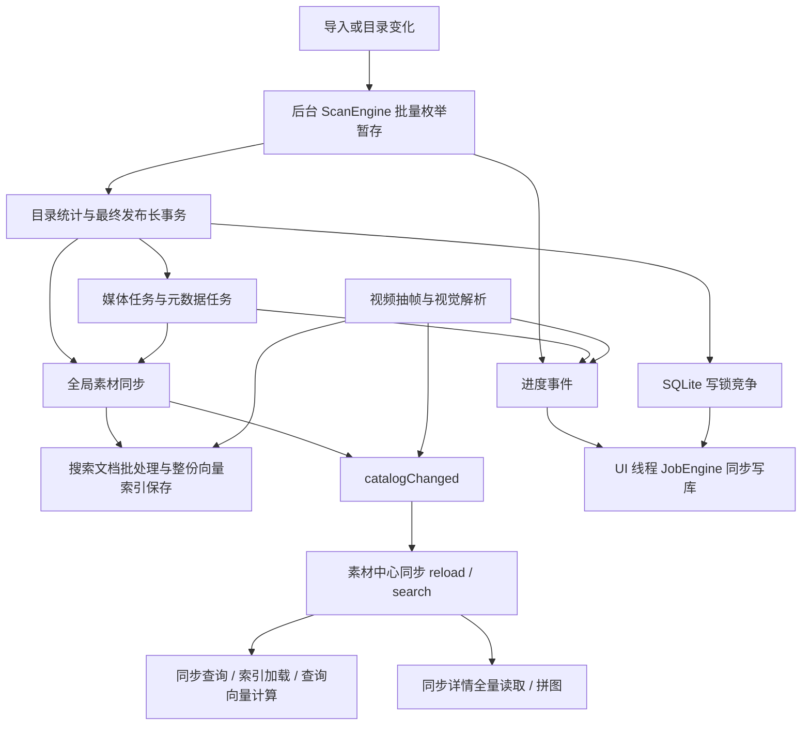
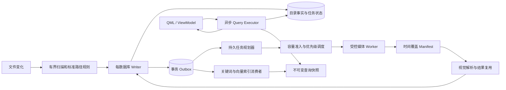

# 影资管家全链路故障审计与架构优化改造报告

日期：2026-09-05

审计对象：当前工作区 v0.1.203；基础提交 `8114b71`，包含本轮开始前已存在的未提交修改。

交付性质：架构审计、隔离复现和改造设计；本轮没有实施业务修复，也没有宣称软件故障已经消失。

## 1. 核心判断

**当前问题来自跨模块契约不完整：后台任务有了分页，但 UI、数据库写入、索引保存和视频解码没有共同遵守资源上限；抽帧策略有了质量筛选，但没有独立的时间覆盖验收。**

本轮已找到能够解释两项用户故障的代码路径，并通过当前源码的隔离实验确认部分机制。尚未取得用户发生卡死时的调用栈、日志和原视频，因此不能认定每一次现场故障都由同一个原因触发，更不能把本报告当作全部潜在 Bug 已被穷尽的证明。

最重要的结论：

1. **大量文件卡死具有真实的主线程阻塞路径。** 素材中心搜索、详情查询、拼图生成和任务进度写库仍能在 UI 线程执行。后台工作增加后，这些路径会被频繁触发，并可能遇到长事务的写锁。
2. **尾部遗漏至少分成两层。** 场景/间隔过滤没有强制覆盖末个可解码时刻；之后的全片去重和质量硬删除又能删掉后段已抽出的帧。只在末尾“再补一张”无法保证最后几秒的重要变化得到保留。
3. **当前抽帧迁移撤掉了旧保护。** 当前工作区的测试差异明确移除了末帧、指定帧补提取的断言。现有测试重新编译后通过，仍与本轮复现出的尾部缺失同时成立。
4. **“分批”并不等于全链路有界。** 局部目录计数反复扫同一素材源；语义索引每个修改批次仍保存整份索引；抽帧仍先获取全部帧 JSON，再生成全部原分辨率候选 JPEG。
5. **存在功能正确性和恢复风险。** 重建解析先删除旧结果，失败后没有旧代可继续使用；部分搜索增量失败后没有恢复本次待处理集合；整盘监听与普通目录使用的路径规则不一致，已复现变化路径丢失。
6. **建议保留 Qt/C++、SQLite、现有扫描暂存和增量日志基础，改造执行边界与数据契约。** 当前证据不支持以更换框架、增加线程或直接换数据库作为第一步。

## 2. 证据边界与交付物

### 2.1 证据等级

| 标记 | 含义 |
|---|---|
| E1 | 直接编译当前相关源码或提取当前 SQL，完成隔离复现；不代表运行了完整 GUI |
| E2 | 当前代码及调用方足以确认机制，但未在真实数据量/故障现场测得影响大小 |
| E3 | 满足特定时序、输入或故障条件时成立的风险，需要故障注入或现场采样 |

优先级按影响与阻断程度设置：P0 为阻塞使用或可丢失已生成结果的优先改造项；P1 为高影响功能/性能问题；P2 为扩展边界或观测缺口。优先级不等于已经测得生产环境发生概率。

### 2.2 本轮覆盖

| 范围 | 检查内容 | 边界 |
|---|---|---|
| 扫描/变化监听 | 枚举批次、暂存、局部更新、发布事务、盘符路径、监控溢出 | 没有创建百万真实文件，没有拔盘试验 |
| 媒体/元数据 | 分页、协调器调用、扫描完成后的启动关系 | 没有遍历所有 RAW/相机格式 |
| 素材中心/检索 | 同步调用、详情加载、QML 实例化、语义索引保存与失败恢复 | 没有运行整套 GUI 压测或真实模型推理基准 |
| 视频解析 | 抽帧、筛选、时间戳、计划复用、重建、补解析、取消 | 合成视频复现；未持有用户故障视频 |
| 跨模块 | Job 写库、数据库连接设置、生命周期、内置 Web 搜索入口 | 安装器、备份校验、完整报表排版和账号安全未做专项穷尽审计 |
| 测试体系 | 当前抽帧测试重编译执行；压力测试和 UI 契约测试源码 | 没有运行全套单元测试或完整应用构建 |

起始工作区存在 30 个已修改受跟踪文件，另有未跟踪历史记录。本轮仅新增审计文档和独立诊断工具，原有业务改动保留。**审计分支的文档提交不包含这些起始业务改动；在另一台机器复现前，必须核对证据清单中的源码 SHA-256，不能只 checkout 基础提交。**

交付文件：

- [抽帧与写锁实验结果](G:/app/DIT-tools/docs/架构审计实验-2026-09-05.json)
- [目录计数 SQL 规模实验](G:/app/DIT-tools/docs/架构审计SQL实验-2026-09-05.json)
- [整盘监听实验](G:/app/DIT-tools/docs/架构审计目录监听实验-2026-09-05.json)
- [当前抽帧测试实际输出](G:/app/DIT-tools/docs/架构审计现有抽帧测试-2026-09-05.txt)
- [实验说明与复现方法](G:/app/DIT-tools/tool/architecture_audit_20260905/README.md)
- [源码和产物指纹](G:/app/DIT-tools/docs/架构审计证据清单-2026-09-05.json)
- [唯一任务状态文档](G:/app/DIT-tools/开发任务/324-全链路故障审计与架构优化报告.md)

### 2.3 已有优化应当保留

2026-07-21 的旧报告有价值，但不能作为当前缺陷列表直接复制：

- `ScanEngine` 当前按 256 条枚举批次暂存，已经不是“一个目录全部装入 QVector”。
- `MediaTaskService` 与 `MetadataExtractionService` 当前已有分页；元数据启动前全量预取的旧问题不应再次被描述为当前事实。
- `MaterialCatalogSyncService` 当前有 500 条 Keyset 分页和 `catalog_change_log` 增量同步。
- `LibraryWorkspaceViewModel` 已有后台分页、异步计数和请求代次；**素材库的改善没有完整传递到素材管理中心。**
- `IndexingWorkCoordinator` 已存在，有队列上限、资源租约、优先级和 generation。
- 语义查询使用 try-lock 并禁止在查询路径直接重建，这是已有保护；但加载和查询向量计算仍可能同步发生。
- 索引文件使用 `QSaveFile`，已有单文件原子替换；它并不能自动让 SQLite 和索引文件成为一个事务。
- 已有 RAW worker、重试状态、遥测和关闭恢复标记，后续应复用。

## 3. 当前链路与卡顿放大机制



“任务在后台”只说明部分计算离开了主线程。如果进度通知又回到主线程等待写库，或通知触发同步搜索和全量详情重建，后台吞吐越大，前台反而越容易失去响应。必须同时控制工作量、通知量、数据库等待和渲染量。

## 4. 大量文件与跨模块性能发现

### A01 · P0 · UI 线程仍承担素材中心搜索与重型详情工作（E2）

证据：

- [MaterialCenterViewModel.cpp:977](G:/app/DIT-tools/dit-tools-src/cinevault-pro/src/ui/viewmodels/MaterialCenterViewModel.cpp:977)：`reload()` 同步读取选项，再直接调用 `executeSearch()`；1031 行同步 `searchMaterials()`。
- 同文件 372、382 行：同步服务和视频解析的 `catalogChanged` 清空详情缓存并直接 `reload()`。
- [SemanticSearchIndexService.cpp:732](G:/app/DIT-tools/dit-tools-src/cinevault-pro/src/core/search/SemanticSearchIndexService.cpp:732)：try-lock 成功后仍同步 `ensureReadyLocked(false)` 与 `embedQuery()`；127–188 行的首次就绪会计数和加载整个索引。
- [MaterialCenterViewModel.cpp:1970](G:/app/DIT-tools/dit-tools-src/cinevault-pro/src/ui/viewmodels/MaterialCenterViewModel.cpp:1970)：60ms 定时器到时同步 `fetchDetail()`；2123 行的 120ms 定时器同步生成拼图。

触发：搜索、选中长视频、目录同步、连续视频完成解析。风险随数据规模、冷索引加载和磁盘延迟增加。**定时器只是延后开始，并没有切换执行线程。** Qt 的计时器按对象线程归属发信号：[QTimer 官方说明](https://doc.qt.io/qt-6/qtimer.html#details)。

架构措施：增加独立 Query Executor，工作线程持有自己的数据库连接及检索上下文；请求携带筛选条件、游标、generation，结果仅在 generation 匹配时应用。旧请求可取消/合并，UI 只接收固定大小结果。拼图和解码属于媒体工作队列，不能在 ViewModel 的定时器槽内执行。

### A02 · P0 · 进度写库把后台锁等待传回 UI（E1 + E2）

证据：[JobEngine.cpp:259](G:/app/DIT-tools/dit-tools-src/cinevault-pro/src/core/jobs/JobEngine.cpp:259) 在当前项目分支直接调用 `persistJob()`；[VideoAnalysisService.cpp:3457](G:/app/DIT-tools/dit-tools-src/cinevault-pro/src/application/VideoAnalysisService.cpp:3457) 把进度排入 JobEngine 所在线程。扫描和媒体也通过事件发布进度。[DatabaseMigration.cpp:200](G:/app/DIT-tools/dit-tools-src/cinevault-pro/src/infrastructure/db/DatabaseMigration.cpp:200) 使用 WAL 和 `busy_timeout=5000`。

独立 Qt/SQLite 实验：一个连接持有写事务，另一个在事件循环线程更新进度。实际等待 **5037ms**，返回 `database is locked`，20ms 心跳在这次调用期间触发 **0 次**。

这证明同步写路径在锁冲突下足以冻结事件处理；没有据此声称用户现场已经测得同样的 5037ms。WAL 支持读写并行，但同一数据库仍只能同时有一个 writer：[SQLite WAL](https://www.sqlite.org/wal.html)。

架构措施：进度先更新有界内存状态，按任务 ID 合并；持久化由每数据库一个 writer 执行，终态优先保证落盘。不得靠增加 busy_timeout 或在 UI 中 `processEvents()` 维持表面响应。

### A03 · P1 · 详情是假分页，“全部展开”恢复无界渲染（E2）

证据：

- [MaterialCenterQueryService.cpp:1066](G:/app/DIT-tools/dit-tools-src/cinevault-pro/src/application/MaterialCenterQueryService.cpp:1066)：帧详情查询无 LIMIT，读取全部字段、解析全部 JSON。
- ViewModel 2021 行遍历全部帧构建 QVariantMap；2075 行以后仅截取已有内存列表；1857 行“全部显示”把限制设为总帧数。
- [MaterialCenterWorkspace.qml:1740](G:/app/DIT-tools/dit-tools-src/cinevault-pro/src/ui/qml/workspaces/MaterialCenterWorkspace.qml:1740)：详情使用 Repeater；1773 行图片异步加载不能消除所有 delegate 同时创建的成本。
- `m_detailCache.insert()` 缓存完整详情，未见按字节预算或 LRU 淘汰；没有同步事件清空时，连续查看长视频可累计占用。

Qt 文档明确 Repeater 会创建所有委托项：[Repeater](https://doc.qt.io/qt-6/qml-qtquick-repeater.html)。

架构措施：将详情摘要、帧页、指定时间定位拆成三个接口；帧页用 `(analysis_generation, actual_pts, frame_id)` Keyset 游标；QAbstractListModel + ListView/GridView 按可见区实例化。保留“浏览全部”的能力，通过滚动分页和时间跳转实现。详情/图片缓存按字节设置预算。

### A04 · P1 · 局部扫描目录统计近似 O(A×N)，发布仍有长事务（E1 + E2）

`A` 是受影响目录及祖先数量，`N` 是同一素材源的素材数。

[ScanEngine.cpp:1652](G:/app/DIT-tools/dit-tools-src/cinevault-pro/src/core/scan/ScanEngine.cpp:1652) 的局部扫描分支遍历受影响目录；1683 行每个目录执行三个 COUNT 子查询，其中两个直接计数相同，父目录通过 `length/substr/CASE` 临时计算。源码提取 SQL 的查询计划只按 `source_root_id` 定位后继续过滤，不能按父目录直接定位。

| 合成素材数 | 受影响目录 | 当前 UPDATE 总耗时 | 单次平面 GROUP BY 参考耗时 |
|---:|---:|---:|---:|
| 10,000 | 10 | 33.75ms | 3.11ms |
| 100,000 | 1 | 46.36ms | 37.74ms |
| 100,000 | 10 | 484.48ms | 37.97ms |
| 100,000 | 50 | 2377.97ms | 41.92ms |
| 300,000 | 10 | 1392.63ms | 194.92ms |

实验是 Python SQLite 3.45.3、简化表结构、当前相关索引、单次运行；所有计数核对正确。GROUP BY 仅展示此平面样本的聚合成本，不是已经实现的完整树形替代方案，也不是产品速度提升承诺。

另有两项独立事实：

- 1473–1509 行统计使用一个事务，但 1492 行在 commit 前释放 writer lease，调度器的“可写”状态与 SQLite 的实际写锁不一致。
- 1526–1790 行最终核对发布仍是覆盖整个扫描范围的一次事务。枚举变成 256 条，不能推导发布事务也有 256 条上限。

架构措施：明确存储稳定 `folder_id/parent_folder_id`，直接计数按变更维护，祖先递归数量用增减量汇总；全量扫描先准备新代统计，再短事务发布。writer lease 必须与实际事务生命周期一致，异常路径统一 RAII 回滚。

### A05 · P1 · 协调器覆盖不全，粗资源租约可让前台饥饿（E2/E3）

[IndexingWorkCoordinator.cpp:61](G:/app/DIT-tools/dit-tools-src/cinevault-pro/src/application/IndexingWorkCoordinator.cpp:61) 的租约获取可能阻塞线程；资源目前只有 HeavyIo 和 SqliteWriter 两类，按全局布尔状态管理。

[SearchDocumentSyncService.cpp:958](G:/app/DIT-tools/dit-tools-src/cinevault-pro/src/application/SearchDocumentSyncService.cpp:958) 在整个同步外层同时获取 HeavyIo 与 SqliteWriter，作用域覆盖数据库打开、搜索文档生成、向量推理及保存。优先级只能影响尚未获租约的任务，不能抢占已经持有资源的长任务。

视频解码/视觉请求没有通过该协调器统一申请媒体资源；JobEngine 等 UI 写库也不在统一 writer 边界内。多个全局 QtConcurrent worker 若等待同一个资源，存在共享线程池被等待者占用的风险，尚未用线程转储确认现场池饥饿。

架构措施：调度 admission 与执行分离，等待任务留在队列中，不占工作线程；按数据库、磁盘、解码、推理、网络端点分别设置容量。租约覆盖一个有时长上限的工作片段。先确定全局资源申请顺序，禁止跨阶段持有不再需要的资源。

### A06 · P1 · 语义索引仍有整库写放大与切换风险（E2/E3）

[SearchDocumentSyncService.cpp:381](G:/app/DIT-tools/dit-tools-src/cinevault-pro/src/application/SearchDocumentSyncService.cpp:381) 每批调用 `applyChanges()`；[SemanticSearchIndexService.cpp:698](G:/app/DIT-tools/dit-tools-src/cinevault-pro/src/core/search/SemanticSearchIndexService.cpp:698) 对发生修改的批次保存整份索引。

[SemanticVectorIndex.cpp:140](G:/app/DIT-tools/dit-tools-src/cinevault-pro/src/core/search/SemanticVectorIndex.cpp:140) 先按整份序列化长度申请 QByteArray，再保存。其 load 路径先 `readAll()`。因此 500 条输入分页不等于索引内存固定，也不等于只写 500 条的数据量。

若一次新建 `N` 条索引、每批 `B` 条且每次保存逐渐增大的索引，累计序列化量近似 `B + 2B + … + N`；这个增长机制需要索引大小/写入字节实测确认，不应只看处理条数吞吐。

保存文件发生在 SQL commit 前。QSaveFile 可防止半个索引文件，但无法与数据库共同原子提交。代码已有 dirty/error 状态及重建降级，不能武断写成“必然永久损坏”；但崩溃可能触发重建，UI 侧旧索引实例也需要 generation 校验。

架构措施：采用不可变索引快照 + 有界增量层，按大小/时间合并；每个快照记录 generation、文档水位和校验信息。读者使用稳定快照，后台构建新快照，通过短发布协议切换；数据/文件不一致时保留关键词搜索，并可重放修复。

## 5. 尾部关键帧：从抽取到显示逐层定位

这里的“关键帧”指用户需要的有意义画面，不等同于编码器 I-frame。尾部完整也不等同于简单命中容器声明的 duration：最终依据应是所选视频流的实际可解码 PTS。

### 5.1 本轮视频实验

环境：Qt 6.6.3；实际安装目录中的 FFmpeg 8.0.1；当前工作区 FFmpegAdapter.cpp 直接编译进入独立诊断程序。测试不调用视觉 API，不消耗接口额度，不读取用户素材。

| 样例 | 原始/候选情况 | 当前结果 |
|---|---|---|
| 7.3 秒静态网格，10fps，场景+2秒间隔 | 73 帧；实际末 PTS=7200ms；过滤器候选=0/2000/4000/6000ms | 筛选后仅 0ms，仍返回 success |
| 同视频，“逐帧” | 73 个源帧 | 最终仅 1 帧，末段没有时间记录 |
| 同视频，0.5秒间隔 | 有效视频 | 最终仍仅 0ms |
| 3 秒 A→B→A，10fps | B 在 1–1.9秒，2秒回到 A | 只保留 0ms、1000ms，返回 A 的后段被消除 |
| 0.1 秒单帧，间隔2秒 | 源视频有1帧 | 原始 fps 过滤器无帧；当前适配器失败，附带该 FFmpeg 构建的 MJPEG 编码错误 |
| 上述可成功样例请求最大64×64 | 请求确实传入 | 实际图像256×128，尺寸约束未生效 |

A→B→A 实验单独将最低清晰度设为0，以隔离时间去重机制；曝光规则仍生效。它不是默认阈值下画质表现的评估。短视频的编码器错误只确认在本机该运行时发生；不能泛化为所有 FFmpeg 版本的同一个报错。

### V01 · P0 · 时间覆盖没有成为独立契约（E1/E2）

[FFmpegAdapter.cpp:139](G:/app/DIT-tools/dit-tools-src/cinevault-pro/src/infrastructure/ffmpeg/FFmpegAdapter.cpp:139) 的 SceneAndInterval 只选首帧、场景分数超过阈值或距离上次选帧满足间隔。**最后一段不足间隔且无足够大场景变化时，没有保证末帧入选的条件。** 实验在7200ms末帧的视频上只产生至6000ms的候选。

IntervalOnly/HighFidelity 使用 fps 重采样，也不是“首尾必有”的覆盖计划。重采样涉及舍入与 EOF 处理：[FFmpeg fps 源码说明](https://www.ffmpeg.org/doxygen/trunk/vf__fps_8c.html)。

随后，[VideoAnalysisService.cpp:3046](G:/app/DIT-tools/dit-tools-src/cinevault-pro/src/application/VideoAnalysisService.cpp:3046) 把筛选后的数量当 plannedFrameCount。任务只知道这些“幸存帧”，无法判断本来漏掉了多少时间区域。

应建立 Coverage Manifest：保存源时间轴、首尾锚点、分段覆盖、候选与拒绝原因，验收覆盖后才允许标记“覆盖完成”。最后一帧与最后几秒内的内容变化分别验收。

### V02 · P1 · 全片去重消除时间事件，并有最坏 O(C×U) 比较成本（E1/E2）

[FFmpegAdapter.cpp:458](G:/app/DIT-tools/dit-tools-src/cinevault-pro/src/infrastructure/ffmpeg/FFmpegAdapter.cpp:458) 对每个候选遍历所有已接受 hash，汉明距离≤4即删除。`C` 为候选数，`U` 为已接受的不同 hash 数；它不是 QSet 精确查找，因此不能把整个流程误认为 O(C)。

具体失效：片头/片尾同构图、重复动作、A→B→A、片尾停留产品、静态字幕，都可能留下第一次出现，抹去后续时间位置。清晰度和亮度硬阈值还会直接删除暗场、亮场或淡出，没有在数据库保留 rejected/skipped 原因。

架构措施：相似度用于**复用视觉推理结果**或在限定相邻时间窗内合并；时间轴节点仍保留，并记录复用来源及区间。质量评分用于挑选同一窗口的代表，不能不留记录地删除必须覆盖的窗口。黑场/淡出可以低优先级，但应作为真实时间事件保留。

### V03 · P1 · 视频输入管线无界且尺寸/超时契约失效（E1/E2）

[FFmpegAdapter.cpp:396](G:/app/DIT-tools/dit-tools-src/cinevault-pro/src/infrastructure/ffmpeg/FFmpegAdapter.cpp:396) 先 ffprobe 输出每帧时间戳 JSON，并整份解析；随后 ffmpeg 再遍历输入，输出全部候选。两次命令各有固定120秒上限。

427–451 行抽帧过滤链没有使用 request.maxWidth/maxHeight；等全部候选落盘后才 `entryInfoList()`、逐图解码、筛选删除。PerFrame/高保真、4K/8K、长片会放大临时文件数、解码像素和日志缓冲；已经删除的候选也支付了编码/写盘成本。

举例只作容量估算：2小时30fps共有216,000个源帧；每张候选若平均1MB，逐帧临时数据约216GB。实际编码尺寸和压缩率需实测。单张3840×2160的32位解码图像约31.6MiB，未计其它缓冲。

措施：受控媒体 worker 按窗口解码、在线选帧、限制像素和临时字节；元信息轻探测与精确时间轴扫描分开。进度型超时区分“正在解码”与“无输出卡住”，并有可执行的取消通道。日志必须有界，不把长片完整 showinfo 留在内存。

### V04 · P1 · 帧身份、时间戳和策略指纹不完整（E2/E3）

- 483 行将幸存帧重新编号为连续序号，已不再是源帧号；但模型仍保留 `requestedFrameNumbers` 等旧字段，形成两套语义。
- fps 策略使用 `index × interval` 作为时间戳，属于输出网格时间，不能当成实际选中的源帧 PTS。非零起点、VFR 和舍入时必须单独验证。
- showinfo 正则不完整支持负数/科学计数法，缺记录时回退到间隔时间；可能导致部分时间错误。应解析结构化时间轴，解析失败显式标记。
- ffprobe 明确选择 `v:0`，ffmpeg 抽帧未指定同一流的 `-map`。多视频流/附带封面场景有探测流与抽取流不一致风险，需要样例验证。
- [VideoAnalysisService.cpp:2978](G:/app/DIT-tools/dit-tools-src/cinevault-pro/src/application/VideoAnalysisService.cpp:2978) 判断复用的字段没有完整包含 extractionStrategy、sceneThreshold、minimumSharpness、输出尺寸和解码版本。相同 interval 下换策略，Resume 不一定重新规划。
- [VideoAnalysisService.cpp:1055](G:/app/DIT-tools/dit-tools-src/cinevault-pro/src/application/VideoAnalysisService.cpp:1055) 的补解析判定只检查现有帧是否解析完整；既不校验尾部时间，也不证明候选集合完整；空帧列表的 `any_of` 也返回 false。

措施：分离 `frame_id`、`source_frame_index`、`actual_pts/time_base`、`presentation_ms`、`sample_ordinal`。策略使用规范化配置摘要 `plan_hash`，模型/提示词使用独立 `analysis_hash`；不同变化分别触发重新抽样或重分析。补解析按覆盖缺口规划，不能只看既有行的成功率。

### V05 · P0 · 重建先删旧结果，失败无法回退（E2）

[VideoAnalysisService.cpp:2991](G:/app/DIT-tools/dit-tools-src/cinevault-pro/src/application/VideoAnalysisService.cpp:2991) 在抽帧前调用 `deleteAnalysisArtifacts()` 并 commit；[FFmpegAdapter.cpp:383](G:/app/DIT-tools/dit-tools-src/cinevault-pro/src/infrastructure/ffmpeg/FFmpegAdapter.cpp:383) 随后清理旧抽帧目录。新流程超时、被阈值全部筛掉、磁盘不足或崩溃时，旧结果已经无法通过事务恢复。

措施：按 `analysis_run_id` 写新一代目录、帧计划和解析结果，旧代保持可读；在新代满足验收后短事务切换 `active_run_id`。新代失败保留诊断和可续跑进度，旧代垃圾回收延后。切换抽帧规则时尤其不能批量清空全部历史解析。

### 5.2 详情缺帧应当如何诊断

未来详情页应能回答四个问题：是否计划覆盖此时间段、是否成功解码、是否作为代表/复用帧保存、当前搜索/分页是否隐藏。

当前搜索条件会过滤 `m_detail.frames`，初始只显示24帧；因此“右边没看到”还可能来自过滤和展开状态，不能一律归为解码问题。反过来，实验中只剩0ms的情况已经在进入 UI 前发生，增加 UI 展开数量无法补回它。

建议显示“时间覆盖 / 解析成功 / 已加载 / 当前匹配”四组计数，以及尾部覆盖状态；一键定位最后已覆盖时刻，并允许用户查看失败原因与补齐缺口。

## 6. 潜在功能与可靠性问题

### R01 · P1 · 整盘监听丢失深层变化路径（E1 + E2）

[SourceChangeMonitor.cpp:33](G:/app/DIT-tools/dit-tools-src/cinevault-pro/src/application/SourceChangeMonitor.cpp:33) 的私有 `isPathInside()` 始终拼接 `root + '/'`；当 root 已为 `G:/`，会形成 `G://`，子路径匹配失败。

直接编译当前 SourceChangeMonitor，通过已有 testing seam 注入 `G:/DCIM/sample.mov`：

- 素材源为 `G:/`：收到空 changedPaths，overflowed=false。
- 素材源为 `G:/DCIM`：收到目录与文件两个路径。

[ImportService.cpp:278](G:/app/DIT-tools/dit-tools-src/cinevault-pro/src/application/ImportService.cpp:278) 将空变化目录直接视为扫描完成。结果是整盘深层文件变化可能不更新索引。根目录直属文件与深层文件的表现还可能不同。

值得关注的是：[ScanPathPolicy.cpp:51](G:/app/DIT-tools/dit-tools-src/cinevault-pro/src/core/scan/ScanPathPolicy.cpp:51) 已经正确处理尾斜杠，但监听器复制了一份不一致的逻辑。这是“旧坑在另一模块重现”的直接例子。

措施：一个共享 PathIdentity/Containment 实现，扫描、监听、缓存排除、导入全部使用。覆盖盘符根、UNC 根、大小写、尾分隔符和目录边界测试。注入实验不等同于已完成真实 ReadDirectoryChangesW 事件验收。

### R02 · P1 · 搜索增量消费失败后缺少可靠重放（E2/E3）

[SearchDocumentSyncService.cpp:902](G:/app/DIT-tools/dit-tools-src/cinevault-pro/src/application/SearchDocumentSyncService.cpp:902) 提取待处理集合后，924–927 行清空 pending；1031–1045 行失败回调仅发布失败并检查新 pending，没有把本次失败集合放回。

[MaterialCatalogSyncService.cpp:1688](G:/app/DIT-tools/dit-tools-src/cinevault-pro/src/application/MaterialCatalogSyncService.cpp:1688) 在全局素材同步成功后确认上游日志，这不代表下游语义同步也成功。若后续没有新事件/全量同步，该批搜索结果可能继续陈旧。

措施：事务 outbox + 每消费者独立水位，写入与事件记录同事务；消费成功才推进自身 offset。暂时失败按持久化 `retry_at` 重试；项目/进程重启仍可恢复。不能用有界内存集合替代可靠消息记录。

### R03 · P1 · 停止排队与取消正在运行的任务不是同一件事（E2/E3）

[VideoAnalysisService.cpp:1448](G:/app/DIT-tools/dit-tools-src/cinevault-pro/src/application/VideoAnalysisService.cpp:1448) 的 cancelPendingWork 清理内存待办；beginShutdown 设置标志，但主要运行循环和 FFmpeg 进程没有相应的及时取消通道。逐帧网络重试最多3次，不代表整段视频会在短时间内停止。

[AppContext.cpp:337](G:/app/DIT-tools/dit-tools-src/cinevault-pro/src/app/AppContext.cpp:337) 有8秒 shutdown barrier，超时使用 `std::_Exit(EXIT_SUCCESS)`。这避免永远卡在退出，却可能截断未完成解析、文件/索引发布与待执行队列；已有恢复标记能提示恢复，但不能代替持久化任务和一致性协议。

措施：持久任务 claim/lease、每阶段取消令牌、进程 terminate/kill 升级、网络取消与统一 deadline；shutdown 先停止 admission，再落盘待办并取消运行任务。恢复通过任务租约和 run generation 实施，不靠文案表示“已保存”。

### R04 · P1/P2 · 内置 Web 搜索扩大同一阻塞入口，HTTP 收包不完整（E2/E3）

[WebSearchService.cpp:316](G:/app/DIT-tools/dit-tools-src/cinevault-pro/src/application/websearch/WebSearchService.cpp:316) 每次 readyRead 直接将 readAll 交给 routeRequest，没有完整请求头的累计状态。TCP 分片可能产生误判；没有在这条路径看到请求大小、header deadline 和并发队列的完整限制。

486、525 行同步调用相同的搜索/详情服务。AppContext 153 行将服务创建为自身子对象，未见移入独立线程；浏览器请求可以加重桌面事件循环负担。252 行监听 AnyIPv4，使范围扩展到可达网卡；是否允许局域网访问应成为明确产品配置，默认监听范围、身份验证和限流需要专门验收。

措施：优先使用成熟 HTTP 请求处理组件，或至少实现完整头解析、上限、超时与断开清理；复用 Query Executor，按客户端限制在途任务。这里是代码风险分析，没有对外部网络进行攻击或扫描。

### R05 · P1 · 测试通过不能证明原始故障已修复（E1/E2）

本轮当前抽帧测试重新编译并执行：**3 passed，0 failed，0 skipped**；其中只有1个实际业务测试，其余为初始化/清理。源码只检查非空、连续编号、文件存在，没有尾 PTS、间隔覆盖、图像尺寸、A→B→A 和恢复正确性断言。

与 HEAD 比较，旧 `fixedInterval_includesAndRepairsTerminalFrame()` 改为候选质量测试，末帧与指定帧修复检查被删除。策略改名应更新测试输入，而不能取消用户可见正确性契约。

[LargeCatalogStressTest.cpp:64](G:/app/DIT-tools/dit-tools-src/cinevault-pro/tests/stress/LargeCatalogStressTest.cpp:64) 缺少环境变量时跳过；当前实现主要扫描空文件，并在 waitForIdle 后才 processEvents，不包含真实素材解码、素材中心持续交互与搜索索引联动。这类测试可以验证扫描数量和队列，不能证明端到端 UI 不卡。

`MaterialCenterUiContractTest` 中的源码字符串检查适合限制局部结构，不能替代 QML 实例数、心跳延迟和数据库等待的运行门禁。

## 7. 目标架构与模块职责

### 7.1 目标数据流



### 7.2 应新增或明确的边界

| 边界 | 负责 | 不应承担 |
|---|---|---|
| CatalogRepository + DbWriter | SQL、事务、幂等更新、outbox | QML 转换、媒体解码、模型调用 |
| Query Executor | 独立线程连接、游标查询、generation、取消 | 修改 UI 对象、复用 UI 线程 QSqlDatabase |
| Pipeline Scheduler | admission、资源配额、租约、优先级、公平性 | 持资源执行整条流水线 |
| Media Worker | 探测、选定视频流、窗口解码、图像限额、进程回收 | 直接写全局解析业务状态 |
| Coverage Planner/Validator | 首尾与时间段覆盖、候选选择、拒绝记录 | 用视觉 API 成功率替代时间覆盖率 |
| Analysis Runner | 消费有界帧页、API 重试、模型版本、复用结果 | 管理 UI 详情和全库查询 |
| Index Consumer | 独立水位、增量索引、快照发布 | 每500条重写全部索引并占用所有资源 |
| ViewModel | 展示状态、发送用户意图、应用有限结果 | 同步 I/O、完整媒体详情驻留、业务事务 |

这些模块不必一次全部新建类。优先从当前大 Service 提取稳定接口和所有权，逐条迁移调用方；避免只把几千行代码机械分文件、增加层数却保留原调用链。

Qt SQL 连接必须在其所属线程使用；异步改造时要创建 worker 自己的连接：[Qt SQL 线程规则](https://doc.qt.io/qt-6/threads-modules.html#threads-and-the-sql-module)。本机为 Qt6.6.3，不应直接套用较新 Qt 才提供的迁移连接 API。

### 7.3 需要固化的数据契约

建议按迁移成本逐步引入：

```text
analysis_run:
  run_id, asset_id, source_fingerprint, plan_hash, analysis_hash,
  status, active_generation, created_at, failure_kind

frame_sample:
  frame_id, run_id, stream_index, source_pts, time_base,
  presentation_ms, sample_ordinal, selection_reason,
  quality_flags, duplicate_of, storage_state, image_revision

coverage_segment:
  run_id, start_pts, end_pts, required, status, representative_frame_id,
  rejection_reason, terminal_anchor_verified

pipeline_job:
  job_id, idempotency_key, stage, resource_class, priority,
  state, lease_owner, lease_expires_at, retry_at, attempt, input_generation

outbox / consumer_offset:
  sequence, entity_id, revision, event_type, payload_version
  consumer_name, committed_sequence
```

这些是设计草案，不是已执行数据库迁移。`asset_id` 要保留当前素材身份；新 run 的 frame_id 不再借用会变化的“第几张候选”。同一文件内容变化时创建新输入代次，不能让旧任务覆盖新结果。

### 7.4 时间覆盖策略

1. 明确选择视频流，建立实际 PTS 时间轴；统一展示起点但保存原 PTS/time_base。
2. 首帧和最后可解码帧设置 required anchor，尾部即使暗场也保留覆盖记录。
3. 全片按镜头边界与最大允许时间间隙规划代表帧；最后数秒单独提高采样密度。建议先试最后3秒、250ms窗口，再根据实际素材/成本校准，不作为未经验证的固定最优参数。
4. 同一窗口优先保留画质更好的帧；若没有合格帧，状态为低质量代表或解码失败，不能从计划中消失。
5. 重复画面可复用推理结果，但保留后续出现的时间节点与持续区间。
6. “逐帧”若作为产品承诺，必须保留每个可解码时刻的记录；若实际只提供代表帧，应改为准确的策略名称，并显示覆盖粒度。
7. 覆盖完整、解析完整、摘要完整分别记录。任何一项失败不能靠幸存帧100%成功而全部标绿。

### 7.5 扫描、索引与发布一致性

- 全量扫描：有界暂存、分批统计，保留旧可见代；完整性检查后短事务发布新 generation。
- 局部扫描：变更批次更新稳定资产/目录 ID，累积计数差异；明确每批可见的一致性语义。不要为单文件变更复制整库快照。
- 全局素材同步：现有 generation 多用于标记与清理，UPSERT 仍原地更新同一主键，不应直接宣称已经提供完全不可变快照。需要一致读取的查询必须带 published revision 或使用明确的发布表。
- 搜索：目录事实是可重建的索引来源；每个消费者保存自己的水位。FTS 与向量索引可独立降级，不能因为向量失败阻塞目录可用性。
- 文件发布：先写临时新代、校验完整，再切换引用；回收旧代采用延后清理，处理重启和仍在读取的查询。

## 8. 资源预算与性能验收

以下是**建议起始目标，不是当前测得能力，也不是无条件承诺**。阶段0在固定参考机、固定运行时上确定最终阈值；此后不得因测试失败临时放宽。

| 项目 | 建议初始约束 | 测量方式 |
|---|---|---|
| UI 阻塞 | 单次结果应用尽量≤16ms；心跳P95≤50ms、P99≤100ms，持续压测无>500ms事件循环停顿 | 独立20ms心跳、主线程长任务/调用栈采样 |
| 首次交互反馈 | 用户动作100ms内显示已接收；可取消搜索不得等数据库完成才显示忙碌 | 记录 input→ack 与 input→result 两个时延 |
| 查询页 | 素材100–200条，帧24–60条；最多保留有限预取页 | 查询行数、模型行数、delegate数 |
| UI 图片缓存 | 按解码字节预算，先试128–256MiB | 缓存驻留和实际像素数 |
| 扫描枚举 | 保留现有256条批次；所有新增队列必须有最大容量 | 峰值条数与字节数 |
| 数据库 writer | 每数据库1个 writer；普通批次目标≤50ms，慢事务必须有原因和上限 | begin/commit耗时、排队时间、busy次数 |
| 解码 | 初期1个重型解码槽；每worker有像素、字节、临时空间和无进展期限 | 子进程树CPU/RSS/IO/存活时间 |
| 后台内存 | 非索引队列占用与总素材数解耦；百万文件较10万文件的额外队列内存应有明确固定上限 | 分组件统计，不能只看主进程工作集 |
| 向量索引 | 索引体积随文档数增长必须显式预算；避免另外持有多份全量序列化副本 | 索引加载峰值、序列化字节、读写放大 |
| 进度与刷新 | 进度最多4次/秒/任务且聚合全局输出；UI只更新相关可见行 | 发布与消费计数、丢弃过期数、队列年龄 |
| 取消 | queued立即取消；普通工作≤2秒到检查点；进程阶段配置≤5秒停止目标 | 请求→停止实际用时、遗留进程检测 |
| 尾部覆盖 | 所选流最后可解码PTS存在required记录；最后窗口没有未说明的覆盖空洞 | PTS对比、尾部事件样本、拒绝理由 |
| 增量一致性 | 队列失败/重启后能重放至相同consumer watermark | 故障注入、源事实与投影校验 |

不能设置“所有内存永远不随 N 增长”这种不成立目标：目录缓存可以有界，但完整向量索引本身通常随文档数增长。必须把索引常驻、临时序列化、解码缓冲和业务队列分开核算。

## 9. 分阶段实施与退出条件

### 阶段0：冻结正确性契约，补齐基线

首先固化本轮源码指纹、运行时、合成样例和用户可见语义。补回末帧/尾部覆盖、重复时间事件、输出尺寸、盘符路径、重建失败保留旧代等行为测试。记录真实应用在“导入+解码+搜索+滚动”并行场景的心跳、队列、SQL等待和调用栈。

输出：可复跑基线与性能预算、归属明确的问题清单。退出条件：至少能稳定复现目标故障的一条端到端路径；若现场与隔离结果不同，先修正归因再实施。不得以已有绿色测试代替这个阶段。

### 阶段1：建立前台执行与读写边界

迁移 MaterialCenter 搜索/详情/拼图、Job 持久化、Web 搜索到 Query Executor/Writer/媒体工作队列；用有限页模型替换详情 Repeater 全部展开。顺带统一路径判定的唯一实现，以共享契约测试约束调用方。

优先文件：MaterialCenterViewModel/QueryService、JobEngine、WebSearchService、MaterialCenterWorkspace.qml、SourceChangeMonitor/ScanPathPolicy。

退出条件：主线程不执行数据库等待、解码、推理；大列表加载不随总帧数创建控件；盘符根监听测试通过。回滚：保留旧读接口的隔离开关，数据库不作破坏性变更。

### 阶段2：建立解析 generation 与 Coverage Manifest

先保证重建失败保留旧代，再切换采样策略。把 FFmpeg 全片临时输出替换为有界窗口/在线候选，补齐真实PTS、尾部覆盖和重复推理复用。plan_hash 纳入完整配置，frame_id 与显示序号分离。

优先文件：FFmpegAdapter、VideoAnalysisService、Entities、GlobalDatabaseManager、VisualAnalysisMetadata，以及帧详情数据接口。

退出条件：CFR/VFR、短片、暗尾、重复片尾、A→B→A、损坏尾、取消恢复通过；旧解析始终可读。回滚：切换 active_run_id，保留旧 generation，不删旧帧。

### 阶段3：调度与扫描统计治理

按资源域分配 admission；任务先入持久队列，执行阶段有限持租约。目录计数改增量汇总；全量发布与局部变更采用各自明确的一致性协议，修正事务与租约生命周期。

优先文件：IndexingWorkCoordinator、ScanEngine、DatabaseManager、MediaTaskService、MetadataExtractionService、BackgroundMaintenanceCoordinator。

退出条件：10万→100万文件测试队列有界，交互延迟在预算内；后台不饿死前台，也有最低进度保障；拔盘/取消不破坏旧索引。

### 阶段4：搜索投影与索引快照

为目录、FTS、向量消费者配置独立水位；持久化失败重放；引入快照/增量层发布，消除每小批整索引保存和整流程占writer的问题。

优先文件：MaterialCatalogSyncService、SearchDocumentSyncService、SemanticSearchIndexService、SemanticVectorIndex、GlobalDatabaseManager。

退出条件：随机中断/磁盘满/提交失败后可恢复；索引代次与文档水位一致；测量并约束写放大；冷/热查询均不阻塞UI。

### 阶段5：综合压力与灰度发布

使用固定素材矩阵运行并发交互测试、12小时稳态测试、升级回滚测试；小规模灰度后扩大数据量。每一阶段完成独立验证后正常提交，不把整份架构重写压成一个无法定位回归的大提交。

退出条件：所有P0关闭、P1有明确通过证据或约定边界；性能门禁与功能门禁都通过。单机调试通过不等于可发布。

### 迁移必须遵守

- 数据库采用扩展→回填→双读校验→切换→延后清理。回填按游标可恢复，开始前评估空间，禁止自动复制无限大的数据库。
- 旧记录无法还原真实PTS时标记 legacy/unknown，不把候选序号乘帧率伪装成原始时间。
- 缓存键包含源指纹、run、策略摘要、图片尺寸/修订；避免新旧图片 URL 相同造成缓存误显示。
- 旧帧与旧摘要保留到新代验收；迁移期间接口请求采用幂等键，失败不得无限重复付费解析。
- 保持素材ID稳定，报告导出、帧搜索、时间跳转和多维度解析调用方一起核对。
- 不更换版本体系、不擅自改写用户现有工作区；每个实施任务维护一份开发文档。

## 10. 验证矩阵与防回归门禁

| 维度 | 必测集合 | 必须断言 |
|---|---|---|
| 文件规模 | 1千、1万、10万、100万；深树、扁平、大量子目录 | 条数、增量统计、队列/内存上限、UI心跳 |
| 混合工作 | 扫描+缩略图+元数据+解析+搜索+滚动同时执行 | 取消有效、无长期饥饿、刷新可合并 |
| 视频时间轴 | 1帧、短于间隔、非整数时长、23.976/29.97/60fps、VFR、非零PTS | 源PTS映射、首尾锚点、顺序、重复/漏样本 |
| 视频内容 | 暗尾、亮尾、字幕片尾、静态片尾、快速变化、A→B→A | required窗口保留、拒绝原因、复用不丢时间事件 |
| 格式 | H.264/H.265/ProRes、旋转视频、多视频流、音频长于视频、损坏尾 | 流选择一致、终点为可解码PTS、显示尺寸正确 |
| 大型媒体 | 4K/8K、2小时素材、逐帧/高保真 | 像素预算、临时空间上限、进度、子进程回收 |
| 失败注入 | SQLITE_BUSY/FULL、API超时/429、磁盘拔出、程序关闭、索引保存后SQL提交前中断 | 旧代可读、任务可重放、水位一致、有限重试 |
| UI | 1万以上帧记录、全部浏览、切换视频/项目、持续搜索、Web并发 | 页数/控件数有界、过期结果不覆盖当前选择 |
| 路径 | G:/、UNC、尾斜杠、大小写、相似前缀目录 | 扫描与监听共用规则、不会漏掉合法路径 |
| 发布 | 源码/运行时哈希一致、新旧版本升级回退 | 测试确实对应本次源码；禁止旧exe“代验收” |

持续集成策略：

- 快速门禁运行小视频覆盖测试、路径测试、事务/取消测试，不依赖外置大目录。
- 定时或专用性能机运行大规模基准；未配置 fixture 的 skipped 必须显示为“未执行”，不能并入通过率。
- 保留主线程调用栈、UI心跳分位数、SQL事务/排队时长、各队列最大深度、索引序列化字节、候选/保留/拒绝/覆盖计数。
- 性能报告绑定 commit、dirty源码指纹、Qt/FFmpeg/模型版本、CPU/内存/磁盘和冷热条件。
- 参数调整必须同时检查召回、尾部覆盖、处理成本；不能只让失败提示消失。

## 11. 应停止的改法

| 反复出现的做法 | 为什么不够 | 替代方向 |
|---|---|---|
| 再加定时器/防抖 | 延迟重活但仍阻塞UI；多来源事件仍可能堆积 | 执行线程边界、合并队列和有限结果 |
| 增加线程/视觉并发 | 不能减少重复SQL、整索引保存和原图解码，反而放大竞争 | admission、每资源预算、端点并发限制 |
| 单独把尾帧 append 回去 | 下一层仍可能去重删除；最后几秒事件仍可能缺失 | Coverage Manifest + 时间节点与推理去重分离 |
| 持续降低清晰度阈值 | 能增加幸存帧但同时增加IO/API成本，不能证明时间完整 | 时间窗口代表选择与质量原因记录 |
| 增大 SQLite busy_timeout | 让UI等锁更久 | writer隔离、短事务、幂等异步落盘 |
| 不断缩小读取批次 | 整索引保存频率可能更高 | 测量全链路工作量与写放大 |
| 重建前清空所有旧结果 | 新流程失败后用户失去原可用结果 | 新代构建与原子引用切换 |
| 只看空文件扫描通过 | 未覆盖解码、索引、UI与写锁争用 | 真实混合负载端到端门禁 |

## 12. 本轮实际完成情况

已完成当前源码调用链审计、5组视频场景诊断、当前抽帧测试重编译执行、5组SQL规模实验、Qt事件循环写锁实验、整盘/普通目录监听对照实验，并交付目标架构、迁移顺序和验收矩阵。

首次独立构建使用旧缓存记录中的 Ninja 路径失败；定位为该文件已不存在，改用本机 Visual Studio 自带 Ninja 后成功。没有把构建失败后残留的旧测试程序当作验证结果。

**尚未完成的是软件改造及真实故障现场验收。** 本轮没有修改业务实现、运行全应用构建、执行百万文件GUI压测、调用真实视觉API、测试真实网络盘拔出或用户故障视频。

推荐下一实施动作：按阶段0建立端到端基线，同时把已复现的覆盖/尺寸/路径行为变成不可删除的回归契约；随后完成阶段1的前台执行与读写隔离。开始重建任何历史解析之前，先实现阶段2的旧代保留机制。
