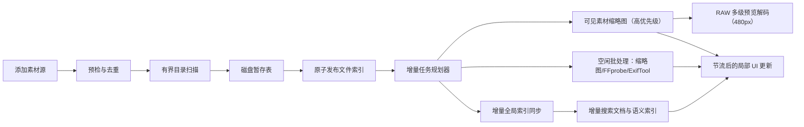

# 影资管家巨量素材源防卡死与防崩溃优化方案

> 日期：2026-07-21  
> 当前基线：v0.1.181 代码  
> 本文范围：添加磁盘卷或巨量素材文件夹后的扫描、缩略图、元数据、全局索引与 UI 刷新链路  
> 实施原则：有界内存、后台执行、增量处理、可暂停恢复、失败不破坏旧索引

## 一、任务目标

1. 添加磁盘卷、百万文件目录或单层巨量文件目录后，主窗口保持可响应，不再因内存暴涨、事件洪峰或数据库长事务卡死、崩溃。
2. 首次扫描、缩略图、FFprobe、ExifTool、全局素材同步和搜索文档同步全部改为有界批处理；内存占用不随文件总数线性增长。
3. 磁盘卷默认先完成轻量文件索引，缩略图和深度元数据按“当前可见优先、空闲补全”渐进执行。
4. 尽可能覆盖市面相机 RAW 文件：优先读取内嵌预览，必要时解码 RAW 像素，统一生成最长边 480px 的预览图。
5. 单文件变化只处理相关文件或目录；正常变化不再触发整卷全量扫描和整库全量同步。
6. 扫描可取消、可暂停、可恢复；程序退出、数据库忙、磁盘拔出、空间不足或文件被独占时保留上一代完整索引。
7. 建立可重复的 10 万、100 万文件压力测试和运行时性能监控，防止后续功能重新引入无界加载。

## 二、现状结论与根因

当前扫描已经放在后台线程，并具备 `scan_session`、暂存表和最终事务切换，这是可复用的正确基础。但“大目录不阻塞”尚未贯穿后续完整流水线。

### 1. P0：真实元数据在 UI 线程全量预取，并在后台再次全量读取

`MetadataExtractionService::startForSourceRoot()` 在启动后台任务前调用 `fetchPendingAssets()`，把素材源全部待处理文件装入 `QVector<AssetFile>`，只为判断是否为空和取得数量。随后 `runExtraction()` 又读取一次完整列表。

影响：

- 第一次全量查询发生在调用线程；该槽由扫描完成信号直接触发，可能冻结 UI。
- 同一批路径、文件名等字符串至少保留两轮，百万文件时极易触发内存不足或进程被系统终止。
- 后台虽按 32 个文件调用 ExifTool，但输入集合本身仍是无界的，并非真正流式处理。

### 2. P0：媒体任务一次性加载全部待处理素材

`MediaTaskService::fetchAssets()` 没有分页或上限。缩略图阶段和 FFprobe 阶段分别把全部待处理素材装入 `QVector`，并顺序持有到整个阶段结束。

影响：

- 与真实元数据服务并行运行时，同一素材源会在多个服务中重复驻留。
- 扫描完成后同时启动缩略图、FFprobe 和 ExifTool，形成 CPU、磁盘、进程和数据库写入竞争。
- 每个文件都排队发送任务进度，缩略图每 6 个文件触发一次目录刷新，百万文件会制造约 16.7 万次刷新请求。

### 3. P0：全局素材同步同时持有多份整库数据

`MaterialCatalogSyncService::syncProjectIntoGlobal()` 一次性读取全部目录和全部素材，并额外构建旧状态 `QHash`、路径映射 `QHash`、当前 key `QSet`、文件夹 key `QSet`。

影响：

- 峰值内存是素材总量的多倍，而不是一个固定批次。
- 每条素材执行多条 SQL；同步期间收到新通知后还会再排一次项目全量同步。
- 扫描、缩略图、元数据任一阶段都可能触发全局同步，造成重复读取与写放大。

### 4. P1：单个巨型目录会形成无界内存和超长事务

`ScanEngine::runResumableScan()` 先把当前目录的所有直接子项放入 `QVector<DirectoryEntry>`，再开启事务逐条写入。目录分层很深时问题不明显，但一个目录内有几十万或上百万个文件时，该向量和事务都会失控。

此外，扫描阶段对每个文件执行一次实际打开探测。对整卷、机械盘、网络盘或受杀毒软件监控的目录，这会把轻量枚举变成大量随机 I/O。

### 5. P1：UI 列表查询和模型重置仍在主线程

`LibraryWorkspaceViewModel::refresh()` 同步读取最多 5000 条素材、执行总数查询、遍历统计状态，再通过 `beginResetModel()` 全量替换模型。频繁的 `catalogChanged` 会重复执行这套工作。

影响：即使后台任务本身不占 UI 线程，高频信号仍可把 UI 事件循环淹没，表现为窗口“未响应”。

### 6. P1：变化监测以素材源为脏标记，整卷会被反复全量核对

当前变化监测只保留“哪个素材源变化”，空闲维护对该素材源重新扫描。系统盘、缓存盘和经常写入的磁盘卷会持续变脏；即便限制每次空闲只扫一次，单文件变化仍会触发下一轮整卷扫描。

### 7. P1：缺少统一资源调度和背压

扫描、缩略图、FFprobe、ExifTool、全局同步、搜索文档/语义索引分别管理自己的后台任务，没有统一的磁盘 I/O 并发、数据库写入并发、内存预算和前后台优先级。

### 8. P1：RAW 识别范围有限，缩略图没有专用解码链

`FileTypeService` 当前只识别 DNG、RAW、ARW、CR2、CR3、NEF、NRW、RAF、RW2、ORF、PEF、SRW、X3F 等少量后缀。`ThumbnailEngine` 对所有图片统一转交 FFmpeg，没有“内嵌 JPEG 预览 → 专用 RAW 解码 → 系统/通用解码”的分层策略。

当前 `ThumbnailRequest` 已默认设置 `maxWidth = 480`、`maxHeight = 480`，尺寸约束可以复用；缺失的是广泛格式识别、专用 RAW 运行时、解码隔离、方向/色彩处理和失败降级。

结论：崩溃不是单个 `QThread` 或 SQLite 参数问题，而是“多个阶段都按整库加载 + 高频通知 + 缺少背压”的叠加结果。

## 三、目标处理架构



全链路必须满足以下不变量：

- 任一内存队列最多保存固定数量的文件，例如 128～512 条。
- 任一数据库写事务最多处理固定批次或固定时长，例如 500 条或 200ms。
- 任一后台服务只有在下游队列有容量时才读取下一批，禁止无限排队。
- UI 进度最多每 250～500ms发布一次；列表刷新最多每秒一次，并只刷新当前页或已变化行。
- 扫描完成只发布“文件索引完成”，不得同时无上限启动全部深度处理。

## 四、模块化实施方案

### 模块 0：性能基线、埋点与故障复现

先建立可量化基线，避免仅凭“感觉不卡”验收。

实施内容：

- 新增合成数据生成工具，覆盖 10 万文件深层目录、100 万文件普通目录、50 万文件单层目录三种形态；文件可为空，不提交测试数据到仓库。
- 记录进程工作集、私有内存、UI 心跳延迟、后台队列深度、SQLite busy 次数、WAL 大小、扫描/同步吞吐和缓存占用。
- 增加阶段日志：枚举、暂存、发布、缩略图、FFprobe、ExifTool、全局同步、搜索同步分别记录开始、结束、批次、耗时和失败原因。
- 对 `std::bad_alloc`、`SQLITE_FULL`、`SQLITE_BUSY`、磁盘拔出和取消建立明确的失败状态，不允许异常越过工作线程边界导致进程退出。

验证：现有版本在合成大目录上能稳定复现至少一个峰值内存、UI 长任务或刷新洪峰指标；优化后使用相同数据对比。

### 模块 1：扫描器改为固定批次流式暂存

这是第一项代码止血模块。

实施内容：

- 删除“先收集整个目录再写库”的 `QVector<DirectoryEntry>`；`QDirIterator` 每读取 256 条即提交一个暂存批次。
- `scan_work_item` 继续作为目录级恢复点。批次中断时把该目录恢复为 `pending`，重新枚举并以 `(session_id, path_key)` 幂等覆盖。
- 开始重扫一个目录前，清除该目录上一轮未完成的直接子项暂存记录，避免批次中断后保留已删除文件。
- 扫描阶段只读取目录项、文件大小、修改时间和类型，不再逐文件打开内容。真实打开由后处理 worker 执行；失败写入“临时锁定/权限拒绝/文件消失”状态并采用有限重试。
- 每处理 250ms 或 1000 条检查取消令牌、项目代次、素材源在线状态和项目盘剩余空间。
- 同一进程默认只允许一个首次扫描；后续可按物理磁盘标识扩展为“每个物理盘一个读取任务”，首版不做复杂磁盘并发推断。
- 扫描 TEMP/暂存数据写入项目数据库前，保留至少 1GiB 安全空间；空间不足时暂停并提示，旧索引继续可用。

验证：50 万文件单层目录扫描时，扫描器批次容器不超过配置上限；取消在 2 秒内生效；中断恢复后无重复、无误删。

### 模块 2：元数据和缩略图改为 Keyset 分页

实施内容：

- `MetadataExtractionService::startForSourceRoot()` 的全量预取改为 `COUNT(*)` 或 `SELECT 1 ... LIMIT 1`，且查询放入后台连接。
- `runExtraction()` 使用 `WHERE af.id > :lastId ORDER BY af.id LIMIT :batchSize`，每次只读取 128～256 条。
- `MediaTaskService` 对缩略图和 FFprobe 使用相同 keyset 分页；处理完成即释放批次。
- 不使用 `OFFSET`，避免页数增大后 SQLite 重复跳过大量记录。
- 每个文件的处理结果直接作为下一轮待处理条件；崩溃后无需保存大内存队列即可续跑。
- ExifTool 保留内部 16～32 条批量调用；FFprobe 默认单文件或小批串行；缩略图默认单工作线程。
- 对任务总量使用开始时的近似计数，运行中允许校正；进度显示不要求预先加载文件对象。

验证：100 万待处理文件时，三个服务任一时刻持有的 `AssetFile` 合计不超过配置预算；重启后只继续未完成项。

### 模块 2A：相机 RAW 全覆盖型 480px 预览链

目标不是宣称“任何未来或私有 RAW 必然可解码”，而是在可合法分发、可维护和不拖垮主程序的前提下，组合当前可用解码能力，最大化真实预览成功率。

#### 1. 解码依赖组合

安装包采用应用私有运行时，不向 Windows 系统目录注册或覆盖编解码器：

| 层级 | 组件 | 用途 | 打包策略 |
| --- | --- | --- | --- |
| L1 | LibRaw 0.22.2 | 主 RAW 解析、内嵌缩略图提取、RAW 像素解码与基础显影 | 必选；MSVC 2022 x64 DLL，固定版本和 SHA-256 |
| L1 扩展 | zlib、libjpeg-turbo、JasPer/等价 JPEG2000 依赖 | Deflate DNG、lossy DNG、旧 Kodak/部分旧格式 | 必选可分发依赖，按实际 LibRaw 构建能力锁定 |
| L1 扩展 | RawSpeed v3 | 为 LibRaw 提供额外/更快的 RAW 解压能力 | 启用，但保留 LibRaw 自带解码回退；动态链接并附 LGPL 文本 |
| L1 扩展 | Adobe DNG SDK 1.7.1 | DNG 1.7、JPEG-XL 压缩 DNG、DNG Stage 2/3 | 完成许可证审计并展示 Adobe 要求声明后打包 |
| L1 扩展 | GoPro GPR SDK | GoPro `.gpr` | 许可证与再分发审计通过后启用 |
| L2 | 现有 ExifTool | 提取 `PreviewImage`、`JpgFromRaw`、`ThumbnailImage` 等内嵌预览 | 已打包；作为 LibRaw 未找到可用预览时的兜底 |
| L3 | Windows Imaging Component | 使用系统或用户已安装的厂商 RAW codec | 运行时探测；不静默安装商店扩展 |
| L4 | 现有 FFmpeg | 能识别的图片/电影 RAW、H.265 内嵌预览和普通图片兜底 | 已打包 |
| L5 | 类型占位图 | 所有解码器失败时仍保证列表稳定 | 必选，明确显示“RAW 暂不支持/预览失败” |

LibRaw 官方当前版本为 0.22.2；其 0.22 全功能构建公布支持 1284 个相机型号，并可报告 RawSpeed、DNG SDK、GPR SDK 和 Unicode 路径等运行时能力。依赖准备阶段必须执行能力断言，不能出现“编译成功但扩展实际未启用”的假全功能包。

RawSpeed 只输出原始传感器数据，不负责白平衡、色彩、去马赛克或可视缩略图，因此不单独作为最终预览提供者，而是作为 LibRaw 的内部解压扩展。若 RawSpeed 返回 unsupported/problem，立即回退到 LibRaw 自带解码器。

#### 2. 初始格式注册表

新增 `RawFormatRegistry`，扩展名仅用于快速路由，最终以文件签名和解码器探测结果为准。初始候选至少包括：

```text
3fr, ari, arw, bay, bmq, cap, cine, cr2, cr3, crn, crm, crw, cs1,
dc2, dcr, dng, erf, fff, gpr, ia, iiq, k25, kc2, kdc, mdc, mef,
mos, mrw, nef, nefx, nrw, orf, pef, ptx, pxn, qtk, raf, raw, rdc,
rw1, rw2, rwl, sr2, srf, srw, sti, x3f
```

其中静态照片 RAW 走 LibRaw 主链；ARI、CINE、CRM 等电影 RAW 优先提取内嵌预览，再交 FFmpeg 或后续可合法分发的厂商 provider。扩展名相同但内容并非 RAW 时不得强行解码。

#### 3. 单文件预览算法

1. 根据绝对路径、文件大小、修改时间、预览配置版本和 RAW 解码包版本生成缓存 key；命中有效缓存直接返回。
2. 使用 LibRaw 只解析容器与缩略图目录，选择“尺寸不小于 480 且最接近 480”的内嵌预览，避免无意义读取最大 JPEG；如果尺寸未知则选择最大可用预览。
3. LibRaw 无预览或预览损坏时，依次尝试 ExifTool 的 `PreviewImage`、`JpgFromRaw`、`OtherImage`、`ThumbnailImage`。
4. 如果只有低于 480px 的内嵌图，先保留为候选，继续尝试 LibRaw 全 RAW 解码；全解码失败后才放大低分辨率候选并标记 `degraded`。
5. 全 RAW 解码使用相机白平衡、sRGB、8-bit 输出和面向缩略图的快速去马赛克；只允许一个 RAW 全解码 worker，避免多张高像素 RAW 同时占用数 GiB 内存。
6. LibRaw 失败后探测 WIC，随后尝试 FFmpeg；所有真实解码失败才生成格式占位图。
7. 应用 EXIF/RAW 方向，保持宽高比，不裁切；最终图限制在 480×480 包围盒内，最长边为 480px。
8. 输出 JPEG，建议质量 85、sRGB、移除无关元数据；先写 `.tmp`，校验能被 `QImageReader` 打开后再原子改名。

#### 4. 解码进程隔离

新增 `CineVaultRawWorker.exe`，主程序不直接加载所有原生 RAW SDK：

- 主程序通过 `QLocalSocket` 或长度前缀 JSON 请求 worker，传入源文件、临时输出、480×480、超时和内存预算。
- worker 串行处理 RAW；单文件超时建议 60 秒，默认内存预算取“可用内存 25%”与 1GiB 中较小值。
- 配置 LibRaw 的 RAW/缩略图内存限制；拒绝异常尺寸、整数溢出和超出预算的分配。
- worker 崩溃、被 OOM 终止或超时，只把当前文件标记失败；主程序重启 worker 后继续下一项。
- worker 处理固定数量文件或私有内存超过阈值后主动重启，降低第三方库长期运行产生的碎片和泄漏风险。
- 只允许读取源文件并写入指定缓存临时路径；不允许网络访问，不加载源目录旁的任意 DLL。

#### 5. 构建、安装与更新

- 新增 `cmake/raw-dependencies.lock.json`，记录 LibRaw、RawSpeed、DNG SDK/GPR SDK（启用时）、zlib、JPEG/JPEG2000 依赖的版本、上游地址、许可证、文件大小和 SHA-256。
- 新增显式 `PrepareRawDependencies.cmake`；依赖缓存必须位于源码树外，应用运行时禁止联网下载原生解码器。
- CMake 增加 `CINEVAULT_ENABLE_CAMERA_RAW` 与 `CINEVAULT_RAW_CACHE_ROOT`；Release 默认开启，最小 GUI 可关闭。
- 安装器携带 RAW worker、DLL、相机定义数据和全部许可证；构建后执行 `raw-worker --capabilities-json`，验证声明能力与锁文件一致。
- 解码包版本进入缩略图缓存 key。客户端升级 RAW 运行时后，过去的失败记录可以自动重试，但不得一次性重建全部成功缩略图。
- RAW 运行时与主程序一起通过现有签名、哈希和更新安装包发布，不做不受控的运行时插件下载。

#### 6. RAW 专项验证

- 建立不进入 Git 的 RAW 样本矩阵，覆盖 Canon CR2/CR3、Nikon NEF/NRW、Sony ARW、Fujifilm RAF、Panasonic RW2、OM/Olympus ORF、Pentax PEF、Samsung SRW、Sigma X3F、Leica RWL/DNG、Hasselblad 3FR/FFF、Phase One IIQ、Leaf MOS、GoPro GPR 与手机 DNG。
- 每类至少覆盖横/竖方向、有/无内嵌预览、损坏文件、超大像素和 Unicode/超长路径。
- 验证输出最长边等于 480px、方向正确、可被 Qt 解码、非空白/全黑、缓存原子写入且不重复生成。
- 记录 `decoder_provider`、`decoder_version`、`preview_source`、耗时、峰值内存和失败码，持续生成实际兼容率报表。
- 发布门禁要求样本库真实预览成功率不低于 98%；剩余失败必须有明确格式/机型/压缩模式和所用解码器记录。

验证：任意单个恶意、损坏或暂不支持的 RAW 不会让主程序退出；批量导入 RAW 时仍遵守模块 2 的分页和模块 3 的背压约束。

### 模块 3：统一资源调度、优先级和背压

建议新增轻量 `IndexingWorkCoordinator`，只负责令牌和状态，不把各服务重写成复杂框架。

资源策略：

| 资源 | 前台活动时 | 系统空闲时 |
| --- | --- | --- |
| 首次扫描 | 1 个低优先级读取任务 | 1 个读取任务 |
| 缩略图 | 仅当前可见/选中素材，高优先级 | 1 个后台 worker |
| FFprobe | 暂停自动派发 | 1 个 worker |
| ExifTool | 暂停自动派发 | 1 个批处理 worker |
| 全局 SQLite 写入 | 最多 1 个 writer | 最多 1 个 writer |
| 语义向量构建 | 暂停 | 复用现有限核策略 |

实施内容：

- 扫描完成先允许用户浏览文件名和目录，不立即并行启动全部深度任务。
- 当前视口素材缩略图进入高优先级小队列；离开视口且尚未开始的请求可取消。
- 空闲任务采用有界队列；队列满时生产者暂停读取下一批。
- 检测到用户输入、应用退出、项目切换、磁盘高延迟或内存压力后停止派发新批次；已进入提交阶段的小批次允许完成。
- 磁盘卷和超过阈值的目录自动启用“安全导入模式”。建议阈值为扫描发现 5 万文件；该阈值只改变调度优先级，不截断索引结果。

验证：扫描完成后不会同时出现扫描、两个元数据任务、缩略图、全局同步和语义构建争抢同一磁盘的情况。

### 模块 4：目录刷新和任务进度节流

实施内容：

- 移除缩略图“每 6 个文件刷新一次目录”的策略。
- 后台 worker 只提交变化的素材 ID；由 UI 聚合器每 500ms 合并一次，优先发送 `dataChanged`，仅筛选条件或排序字段变化时重新查询当前页。
- 任务进度最多每 500ms 或百分比变化时更新一次，不再每处理一个文件都向主线程排队。
- 多个 `catalogChanged` 合并为 generation；UI 如果正在执行上一代查询，直接丢弃过期结果。
- `LibraryWorkspaceViewModel::refresh()` 改为异步只读查询，返回前不阻塞 UI；模型采用插入/替换当前页，避免无条件 `beginResetModel()`。

验证：持续缩略图生成 10 分钟时，UI 事件队列不持续增长；窗口拖动、滚动和切页的 P95 响应低于 100ms。

### 模块 5：素材库改为真正分页和异步查询

实施内容：

- 当前固定 `LIMIT 5000` 改为首屏 200 条，滚动接近底部时 keyset 加载下一页。
- 列表查询使用后台只读连接；结果携带 query generation，旧搜索结果不得覆盖新搜索结果。
- 总数查询独立、可取消并做 300ms 防抖；无筛选时优先使用 `source_root.total_files` 聚合，避免反复 `COUNT(*)`。
- 关键词检索使用现有 FTS/搜索文档能力；巨量库不得在主线程执行多个 `%LIKE%` 全表扫描。
- `AssetListModel` 增加 append、按 ID 更新和清空接口，仅在查询条件整体变化时 reset。

验证：100 万条数据库中打开素材库时只加载首屏数据；首屏可见时间小于 1 秒，主线程无超过 50ms 的同步数据库调用。

### 模块 6：全局素材索引改为增量 generation 同步

实施内容：

- 给全局素材与目录记录增加 `sync_generation`，项目同步开始时生成新 generation。
- 从项目库按 `asset_file.id`、`folder_node.id` keyset 分页，每批 500～1000 条 upsert；不再构造整库 `QVector/QHash/QSet`。
- upsert 时在 SQL 内根据大小和修改时间保留或重置分析状态，避免把旧状态全部加载到内存比较。
- 同步完成后，把该项目中 `sync_generation != current` 的记录标记离线或删除；同步失败时不切换项目的已完成 generation。
- 扫描发布产生 added/changed/removed ID 集合或变更表，正常路径只同步 delta；仅迁移、监测溢出或显式“重建索引”执行全量 generation。
- 同一项目的高频同步请求只保留一个最新 generation，不累计重复任务。

验证：100 万素材全量同步的峰值内存由批次大小决定；修改一个文件只更新对应素材、搜索文档和必要的文件夹统计。

### 模块 7：搜索文档与语义索引增量化

实施内容：

- `MaterialCatalogSyncService` 输出增量变更集后，`SearchDocumentSyncService` 只同步变化文档，不对每轮缩略图或元数据更新执行全量文档收集。
- 缩略图路径变化不进入语义内容哈希，不触发向量重建。
- 元数据批次完成后合并 2～5 秒再提交搜索文档 delta。
- 继续保留现有“旧索引可查询、锁竞争降级关键词”的机制；新增文档收集阶段的 keyset 分页和内存上限。

验证：新增一张缩略图不触发语义重建；修改 100 个素材只生成不超过相应数量的文档更新。

### 模块 8：增量变化监测与磁盘卷规则

实施内容：

- `SourceChangeMonitor` 不只记录素材源 ID，同时合并变化文件路径和父目录；后台只重扫脏目录。
- Windows NTFS 固定卷后续可接入 USN Journal 作为高可靠增量来源；首版先使用现有递归通知的相对路径，通知溢出时才退化为分段全量核对。
- 整卷首次扫描默认排除 `$Recycle.Bin`、`System Volume Information`、卷影副本、应用缓存、项目数据库/缩略图目录和明确的系统临时目录。
- 添加素材源时检测路径重叠：已添加磁盘卷后再次添加其子目录，或反向添加父路径时，必须提示并阻止重复索引，除非用户明确替换原素材源。
- 重解析点、符号链接和挂载点默认不跟随，防止目录环和跨卷重复扫描。
- 监测溢出后的全量核对按目录分片执行，可跨多次空闲会话完成，不能一次占满整段空闲时间。

验证：整卷中新增一个文件时只处理其父目录和一个素材；系统目录持续变化不会形成连续整卷重扫。

### 模块 9：缓存配额、退出屏障与异常降级

实施内容：

- 缩略图改为按需优先并配置 LRU 配额；建议软上限为 10GiB 或项目盘剩余空间的 5%（取较小值），硬上限不超过 20GiB。
- 缓存接近上限时先回收未收藏、长期未访问的缩略图；索引数据库和用户产物不属于可自动删除缓存。
- 应用退出和项目切换时：先停止派发、取消可取消任务、等待当前小事务结束，再关闭数据库；等待超时则保存恢复状态，不强行阻塞 UI 无期限退出。
- 捕获磁盘满、数据库忙、网络盘断开、路径消失、权限拒绝和外部工具崩溃；单文件失败不得终止整卷任务。
- 增加进程级未处理异常和退出原因日志，区分 OOM、外部工具失败、SQLite 错误和主动退出。

验证：运行中拔出移动盘、填满项目盘、锁定文件或立即退出，程序不崩溃；再次启动能继续未完成批次。

## 五、建议实施顺序

1. 模块 0：先加基线与压力工具，得到可复现数据。
2. 模块 1：修复扫描器单目录无界缓冲和长事务。
3. 模块 2：修复元数据/缩略图全量 `QVector`，消除最直接的 OOM 与 UI 预取阻塞。
4. 模块 2A：接入隔离式 RAW 480px 预览链；先完成 LibRaw/内嵌预览，再逐项启用通过许可证审计的扩展 SDK。
5. 模块 4、5：节流通知并把素材库改为异步分页，解决“后台没崩但 UI 未响应”。
6. 模块 3：加入统一资源令牌和可见优先策略，避免多服务并发打满磁盘。
7. 模块 6、7：全局索引和搜索改为 generation/delta，消除整库复制与重复构建。
8. 模块 8、9：增量监测、缓存配额和异常恢复收口。
9. 完成 10 万/100 万压力回归、RAW 样本矩阵、真实磁盘卷验收、Release 构建和版本自动递增。

不得先单独增加线程数或把所有工作简单移到 `QtConcurrent`。这只能把 UI 阻塞转化为更严重的内存、磁盘和 SQLite 竞争，不能解决无界加载。

## 六、预计文件/模块清单

### 建议新增

- `src/application/IndexingWorkCoordinator.h/.cpp`：资源令牌、优先级、暂停和背压。
- `src/application/CatalogRefreshAggregator.h/.cpp`：素材 ID 变化合并与 UI 刷新节流。
- `src/core/thumbnail/RawFormatRegistry.h/.cpp`：RAW 格式、签名与 provider 路由。
- `src/core/thumbnail/RawThumbnailEngine.h/.cpp`：RAW 预览请求、缓存和降级链。
- `src/raw-worker/main.cpp`、`RawDecodeWorker.*`：隔离式 RAW 解码进程。
- `src/infrastructure/raw/LibRawAdapter.*`、`RawWorkerClient.*`：LibRaw 与 worker 通信适配。
- `src/infrastructure/monitoring/PerformanceTelemetry.h/.cpp`：队列、批次、耗时、内存和 UI 心跳指标。
- `tests/stress/LargeCatalogStressTest.cpp`：数据库和服务层压力测试。
- `tests/integration/RawThumbnailCompatibilityTest.cpp`：RAW 样本矩阵和 480px 输出契约。
- `tool/generate_large_catalog_fixture.ps1`：本地合成目录工具，生成物放在工作区外临时目录。
- `cmake/raw-dependencies.lock.json`、`cmake/PrepareRawDependencies.cmake`：RAW 依赖锁定与离线准备。

### 重点修改

- `src/core/scan/ScanEngine.*`
- `src/core/scan/FileTypeService.*`
- `src/core/thumbnail/ThumbnailEngine.*`
- `src/application/ImportService.*`
- `src/application/MediaTaskService.*`
- `src/application/MetadataExtractionService.*`
- `src/application/MaterialCatalogSyncService.*`
- `src/application/SearchDocumentSyncService.*`
- `src/application/SourceChangeMonitor.*`
- `src/application/BackgroundMaintenanceCoordinator.*`
- `src/application/LibraryQueryService.*`
- `src/infrastructure/db/DatabaseManager.*`
- `src/infrastructure/db/GlobalDatabaseManager.*`
- `src/ui/viewmodels/LibraryWorkspaceViewModel.*`
- `src/ui/models/AssetListModel.*`
- `src/ui/qml/workspaces/LibraryWorkspace.qml`
- `src/app/AppContext.*`
- `CMakeLists.txt` 与对应单元测试
- `installer/windows/cinevault.iss`、依赖与第三方许可证清单

## 七、数据迁移建议

1. 项目库新增可选 `access_state`、`last_access_error`、`last_access_attempt_at`，将扫描可见性与实际打开能力分离。
2. 全局库的素材和目录表新增 `sync_generation INTEGER NOT NULL DEFAULT 0`，项目登记表新增 `active_sync_generation`。
3. 可增加项目库 `catalog_change_log`，记录 added/updated/deleted 及 generation；消费成功后按水位清理，避免把巨大 ID 列表放入信号参数。
4. `thumbnail` 表建议增加 `decoder_provider`、`decoder_version`、`preview_source`、`profile_version`、`degraded` 与标准化失败码，支持解码包升级后只重试失败项。
5. 所有迁移必须可重复执行；旧库首次同步可走一次全量 generation，完成后才启用 delta。
6. 发布前用旧版本真实项目库副本验证升级、回滚和中断恢复，不直接在唯一用户库上做破坏性测试。

## 八、待办清单

- [ ] 建立 10 万、100 万、50 万单层目录三组压力基线。
- [ ] 扫描器固定批次枚举与事务提交。
- [ ] 移除扫描阶段逐文件实际打开。
- [ ] 元数据启动检查移出 UI 线程并改为 keyset 分页。
- [ ] 缩略图和 FFprobe 改为 keyset 分页。
- [ ] 建立 RAW 格式注册表并扩展文件类型识别。
- [ ] 锁定并离线构建 LibRaw 0.22.2 全功能运行时。
- [ ] 接入 RawSpeed、DNG SDK、GPR SDK等通过许可证审计的扩展。
- [ ] 实现隔离式 RAW worker 与多级解码回退。
- [ ] 统一生成最长边 480px、方向正确的 sRGB JPEG 预览。
- [ ] 建立 RAW 样本矩阵、能力清单和兼容率门禁。
- [ ] 任务进度与目录变化信号节流、合并。
- [ ] 素材库异步首屏和 keyset 加载更多。
- [ ] 增加统一资源协调器和前台暂停策略。
- [ ] 全局素材索引改为 generation + delta。
- [ ] 搜索文档和语义索引消费 delta。
- [ ] 变化监测保留脏路径，正常变化不再整卷重扫。
- [ ] 素材源重叠检测与整卷默认排除规则。
- [ ] 缩略图 LRU 配额与 20GiB 硬上限。
- [ ] OOM、磁盘满、拔盘、锁文件、取消和退出故障注入。
- [ ] 全量单测、压力测试、QML 门禁、Release 构建和安装包验证。

## 九、验收标准

### 功能与稳定性

1. 可添加 100 万文件素材源并完成轻量索引，进程不崩溃、旧索引不丢失。
2. 添加操作在 100ms 内返回 UI；扫描在后台展示进度，窗口始终可移动、切页和取消任务。
3. 单层 50 万文件目录的内存不随该目录条目数形成同规模 `QVector`；批次峰值符合配置。
4. 扫描中断、程序退出或磁盘拔出后，重启可继续；最后一个已完成 generation 仍可搜索。
5. 锁定或无权限文件只记录单项错误，不终止素材源；释放后可重试恢复。
6. 添加整卷后，缩略图和元数据不会同时无上限启动；当前可见素材优先出现预览。
7. 单文件新增、修改、删除只触发增量目录、全局索引和搜索文档更新。
8. 主流静态相机 RAW 均进入 RAW 专用链并生成最长边 480px 的真实预览；不能解码时显示明确占位和失败原因，不显示永久加载动画。
9. RAW worker 崩溃、超时或超过内存预算不会带崩主程序，下一文件仍可继续处理。
10. RAW 解码依赖版本、运行能力、许可证和 SHA-256 可从构建产物审计；应用运行时不联网下载原生解码器。

### 性能基线

| 指标 | 10 万文件 | 100 万文件 |
| --- | ---: | ---: |
| 峰值私有内存 | ≤ 500MiB | ≤ 1GiB |
| UI 心跳 P95 | ≤ 50ms | ≤ 100ms |
| UI 单次同步工作 | ≤ 16ms，极端不超过 50ms | ≤ 16ms，极端不超过 50ms |
| 后台内存队列 | 每服务 ≤ 512 条 | 每服务 ≤ 512 条 |
| UI 进度发布频率 | ≤ 4 次/秒 | ≤ 4 次/秒 |
| 目录列表首屏 | ≤ 1 秒 | ≤ 1 秒 |
| 取消响应 | ≤ 2 秒 | ≤ 2 秒 |
| 正常退出等待 | ≤ 5 秒 | ≤ 5 秒 |

性能验收以 Release 构建、同一台机器、冷/热缓存分别记录为准；外接机械盘吞吐不设不现实的固定完成时长，但 UI 响应、内存上限和取消时间必须达标。

## 十、风险与取舍

- 将扫描阶段的“实际打开文件”移到后处理后，文件可能先显示为已索引、随后标记临时不可读。这是为了避免整卷逐文件打开造成严重 I/O；UI 需要明确区分“已索引”和“可解析”。
- 全局 generation 同步会增加一次数据库迁移，但可显著降低内存；不建议继续用更小的整库 `QVector` 作为长期方案。
- NTFS USN Journal 能进一步提升整卷增量能力，但实现与权限处理较复杂，应在脏路径增量方案稳定后单独实施。
- 百万文件的深度元数据和全量缩略图可能需要很长时间。产品应承诺“可浏览、可暂停、渐进完成”，不应承诺添加后立即完成全部深度处理。
- “支持某个扩展名”不等于支持该厂商所有机型和压缩模式。新相机、Nikon HE/HE* 等私有压缩和部分电影 RAW 可能只能提取内嵌预览；兼容性界面应展示真实 provider 与失败码，不能宣称绝对全支持。
- Adobe DNG SDK、GoPro GPR SDK及未来厂商 SDK 必须先通过许可证和再分发审计；未通过的组件只能作为用户已安装 provider 探测，不能直接塞入公开安装包。

## 十一、模块完成定义

每个模块必须同时满足：代码完成、对应自动测试通过、压力指标未退化、跨项目/退出链路验证通过、无新增无界容器或逐文件 UI 通知。完成一个模块后执行现有全量回归，再进入下一模块；版本号仅在形成可发布安装包时自动递增。

## 十二、RAW 技术依据

- [LibRaw 0.22.2 下载与变更说明](https://www.libraw.org/download)：当前正式版、相机数量、DNG 1.7/JPEG-XL、RawSpeed 集成与缩略图能力。
- [LibRaw 数据结构与运行能力](https://www.libraw.org/node/31)：RawSpeed、DNG SDK、GPR SDK、Unicode 路径能力位及缩略图格式。
- [LibRaw Windows 构建说明](https://www.libraw.org/docs/Install-LibRaw.html)：MSVC DLL、zlib、JPEG、JasPer 等可选依赖和随应用分发方式。
- [RawSpeed 官方仓库](https://github.com/darktable-org/rawspeed)：解码范围、LGPL-2.1、相机 XML 和“只输出 RAW 数据、不生成可视预览”的边界。
- [darktable 官方支持格式](https://darktable-org.github.io/dtdocs/en/overview/supported-file-formats/)：用于初始化 RAW 候选扩展集合。
- [Adobe DNG SDK 官方页面](https://helpx.adobe.com/camera-raw/digital-negative.html)：DNG SDK 当前版本与必须展示的 DNG 技术许可声明。
